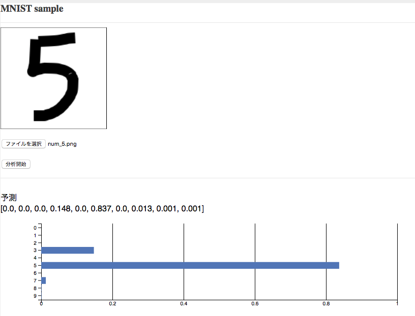

# Watson Machine Learning サンプルアプリ

## アプリケーションの説明
このアプリケーションはWatson StudioでNeural Network Designerで作った手書き数数字を認識する深層学習モデルにWebサービス経由でアクセスし、アップロードしたイメージデータに書かれている数字を認識するアプリです。  

  

## 前提
Watson Studio上で、手書き数字(mnist)認識のための深層学習モデルの構築、学習、保存、テストまでできていることが前提です。  
詳細手順に関しては、[Watson Studioのディープラーニング機能(DLaaS)を使ってみた](https://qiita.com/ishida330/items/b093439a1646eba0f7c6)などを参照して下さい。

## 事前準備
Watson MLのインスタンス名を``machine-learning-1``に変更して下さい。  
インスタンス名の変更は、サービスの管理画面から行うことが可能です。


## 前提ソフトの導入
次の前提ソフトが導入されていることが前提です。

[gitコマンドラインツール][git] (なくても可)   
[Cloud Foundryコマンドラインツール][cloud_foundry]  
  
注意: Cloud Foundaryのバージョンは最新として下さい。 

## ソースのダウンロード
Githubからアプリケーションのソースをダウンロードします。  
あるいは、[Github](https://github.com/makaishi2/mnist-sample)にブラウザからアクセスして、zipファイルをダウンロード後、解凍します。  
カレントディレクトリのサブディレクトリにソースはダウンロードされるので、あらかじめ適当なサブディレクトリを作り、そこにcdしてから下記のコマンドを実行します。  
ダウンロード後、できたサブディレクトリにcdします。
 

```sh
$ cd (適当なサブディレクトリ)
$ git clone https://github.com/makaishi2/mnist-sample.git
$ cd mnist-sample
```

## CFコマンドでログイン
CFコマンドでIBM Cloud環境にログインします。  
ログイン名、パスワードはIBM Cloudアカウント登録で登録したものを利用します。  
ログインに成功すると、次のような画面となります。  

```
$ cf api https://api.ng.bluemix.net
$ cf login
```

  

## アプリケーションのデプロイ

次のコマンドを実行します。
**\<service_name\>** はなんでもいいのですが、インターネット上のURLの一部となるので、ユニークな名前を指定します。  
(例) **wml-mnist-aka**

```
$ cf push <service_name>
```

## 環境変数の設定

WebサービスのエンドポイントURLに関しては、以下のコマンドで、設定する必要があります。  
(注意) scoring_urlは、Waton Machine Learningの管理ダッシュボードより取得できますが、URLの最後に'/online'を付ける必要がある点に注意して下さい。

```
$ cf set-env <service_name> SCORING_URL <scoring_url>
$ cf restage  <service_name>
```

## アプリケーションのURLと起動

デプロイには数分かかります。デプロイが正常に完了したらアプリケーションを起動できます。  
次のURLをブラウザから指定して下さい。

```
https://<service_name>.mybluemix.net/
```

## アプリケーションを修正する場合

導入手順中、git cloneコマンドでダウンロードしたローカルリポジトリにアプリケーションのソースコードが入っています。アプリケーションを修正したい場合は、ローカルのソースを修正し、再度 ``cf push \<service_name\>`` コマンドを実行すると、IBM Cloud上のアプリケーションが更新されます。  

## ローカルで起動する場合

アプリケーションを修正する時は、ローカルでもテストできる方が便利です。そのための手順は以下の通りです。

* Pythonの導入  
ローカルにPython(v3)を導入する必要があります。　MACの場合は最初から導入済みなのでこの手順は不要です。
* 認証情報の確認  
BluemixダッシュボードからWMLサービスの管理画面を開き、接続用の認証情報を調べてテキストエディタなどにコピーします。
* .envファイルの設定  
次のコマンドで.env.exampleファイルの雛形から.envをコピーし、エディタで調べたusername, passwordを設定します。

```sh
$ cp .env.example .env
```

```sh
WML_SERVICE_CREDENTIALS_URL=xxxxx
WML_SERVICE_CREDENTIALS_USERNAME=xxxxxxxx-xxxx-xxxx-xxxx-xxxxxxxxxxxx
WML_SERVICE_CREDENTIALS_PASSWORD=xxxxxxxxxxxx
```

* Pythonアプリケーションの導入、実行  
以下のコマンドでアプリケーションの導入、実行を行います。

```sh
$ python server.py
```

[cloud_foundry]: https://github.com/cloudfoundry/cli#downloads
[git]: https://git-scm.com/downloads
[sign_up]: https://bluemix.net/registration
 
